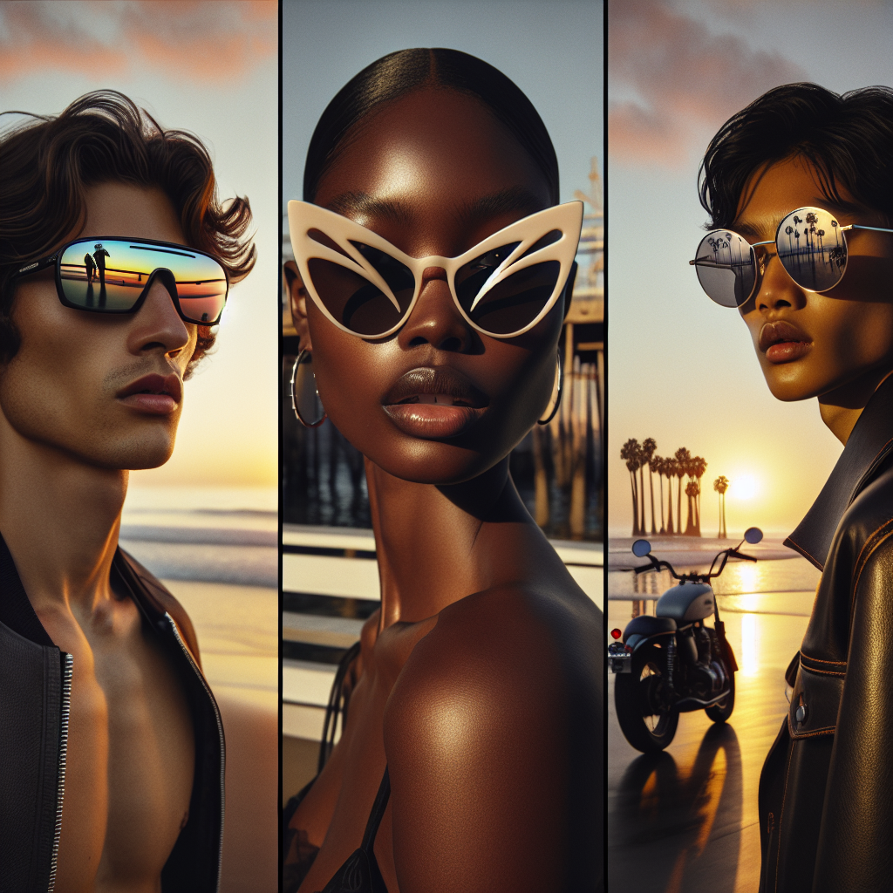

# 🕶️ Summer Sunglasses Campaign – Executive Summary

## 📊 Refined Trend Insights
Executive Summary – Summer 2026 Eyewear Trends  
Date: April 23, 2026  

Overview  
As we approach the 2026 summer season, three distinct eyewear movements are set to define consumer demand: high-performance silhouettes, bold statement shapes, and timeless metallic classics. By aligning our core catalog with these trends, we ensure broad appeal, strong margins, and a cohesive, self-expression–driven campaign.

Key Trends  
1. Performance-Driven Frames  
   • Single-lens shields and wraparounds that marry athletic functionality with urban style.  
2. Sculptural Cat-Eye & Butterfly Profiles  
   • Dramatic angles and soft curves delivering a fresh take on feminine, self-expressive design.  
3. Polished Metal & Retro Revival  
   • Slim, aviator-inspired wire rims and vintage shapes returning as enduring luxury pieces.

Featured Products  
• SG004 “Sport” Wraparound Sunglasses  
   – Oversized single-lens design for maximum coverage, with rubberized grips and ultralight construction.  
• SG003 “Mystique” Cat-Eye Sunglasses  
   – Sculptural upswept frames with subtle temple embellishments, capturing 1950s glamour in a modern package.  
• SG001 “Aviator” Sunglasses  
   – Slim metal frame with classic teardrop lenses, epitomizing the polished-metal trend and vintage appeal.

Strategic Rationale  
• Market Coverage: Each model embodies one of the top three summer trends, allowing us to target sport-oriented, fashion-forward, and heritage-focused segments.  
• Inventory & Profitability: Current stock levels (Sport: 11 units; Mystique: 3 units; Aviator: 23 units) at competitive price points support immediate fulfillment and margin optimization.  
• Cohesive Campaign Opportunities:  
   – “Sport x Style” highlights the wraparound’s dual performance and street credentials.  
   – “Sculptural Statements” emphasizes bold cat-eye narratives.  
   – “Retro Revival” taps into the enduring allure of metal-rim classics.

Next Steps  
1. Finalize creative concepts for each mini-campaign.  
2. Coordinate inventory allocation and pricing approval.  
3. Launch integrated marketing across digital, retail, and social channels by mid-May.

This targeted approach positions us to capture summer’s self-expression momentum, drive sales across key price tiers, and reinforce our leadership in fashionable, high-quality eyewear.

## 🎯 Campaign Visual

    

## ✍️ Campaign Quote
Sport, Sculpt, Shine: Summer's Bold Eyewear Collection

## ✅ Why This Works
This line spotlights all three Summer 2026 trends showcased in the image—oversized wrap-around shields (Sport), sculptural cat-eyes (Sculpt), and polished metal aviators (Shine)—while evoking a confident, self-expressive beach-sunset vibe that ties directly into our campaign’s summer styling pillars.

---

*Report generated on 2026-04-23*
