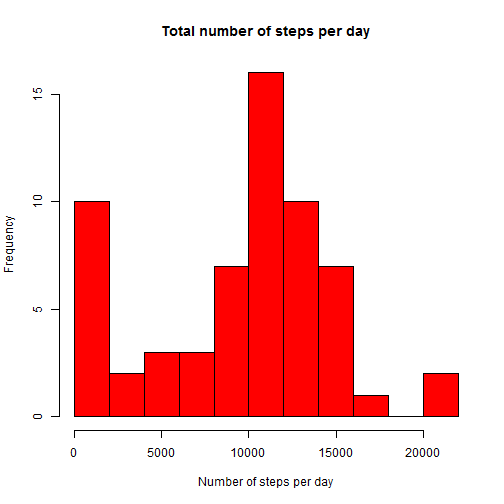
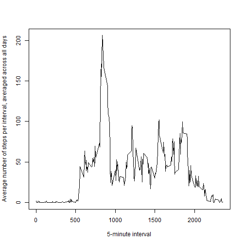
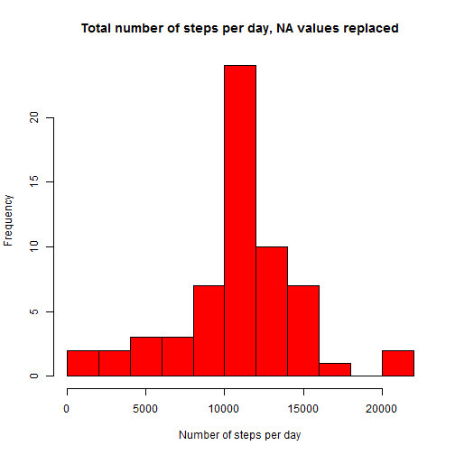

'Reproducible Research: Peer Assessment 1'
====================================================

## Loading and preprocessing the data

### Show any code that is needed to
### 1. Load the data (i.e. read.csv())
### 2. Process/transform the data (if necessary) into a format suitable for your analysis

The code is below.


```r
data <- read.csv("activity.csv")
data$date <- as.Date(data$date) #convert the date column to as.Date
```

## What is mean total number of steps taken per day?
### 1. Calculate the total number of steps taken per day

The total number of steps is calculated below.


```r
startDate <- as.Date("2012-10-01", format = "%Y-%m-%d")
endDate <- as.Date("2012-11-30", format = "%Y-%m-%d")
s <- seq(startDate, to = endDate, by = 'days')
ind <- 1
steps <- list()
for(i in s){
  #print(as.Date(i, origin = "1970-01-01"), format = "%Y-%m-%d")
  temp <- subset(data, date == as.Date(i, origin = "1970-01-01"))
  steps[[ind]] <- sum(temp$steps, na.rm = TRUE)
  ind <- ind + 1
}
data_steps <- cbind(steps, s)
```

### 2. If you do not understand the difference between a histogram and a barplot, research the difference between them. Make a histogram of the total number of steps taken each day

The histogram of the total number of steps taken each day is shown below.


```r
hist(as.numeric(data_steps[,1]), 
     col = "red", 
     xlab = "Number of steps per day", 
     main = "Total number of steps per day", 
     breaks = 10)
```

 

### 3. Calculate and report the mean and median of the total number of steps taken per day

The mean of the total number of steps taken per day is


```r
mean(as.numeric(data_steps[, 1]), na.rm = TRUE)
```

```
## [1] 9354.23
```

The median of the total number of steps taken per day is


```r
median(as.numeric(data_steps[, 1]), na.rm = TRUE)
```

```
## [1] 10395
```


## What is the average daily activity pattern?

### 1. Make a time series plot (i.e. type = "l") of the 5-minute interval (x-axis) and the average number of steps taken, averaged across all days (y-axis)

The time series plot is shown below.


```r
interval_levels <- levels(factor(data$interval))
ind <- 1
steps_interval <- list()
for(i in interval_levels){
  #print(i)
  temp <- subset(data, interval == as.numeric(i))
  steps_interval[[ind]] <- mean(temp$steps, na.rm = TRUE)
  ind <- ind + 1
}
plot(interval_levels, steps_interval, 
     type = "l", 
     ylab = "Average number of steps per interval, averaged across all days", 
     xlab = '5-minute interval')
```

 


### 2. Which 5-minute interval, on average across all the days in the dataset, contains the maximum number of steps?

The 5-minute interval, on average across all the days in the dataset, that contains the maximum number of steps is


```r
interval_levels[which.max(steps_interval)]
```

```
## [1] "835"
```

## Imputing missing values

### 1. Calculate and report the total number of missing values in the dataset (i.e. the total number of rows with NAs)

The total number of missing values is


```r
sum(is.na(data$steps))
```

```
## [1] 2304
```

### 2. Devise a strategy for filling in all of the missing values in the dataset. The strategy does not need to be sophisticated. For example, you could use the mean/median for that day, or the mean for that 5-minute interval, etc.

We replace all the missing values with mean of that 5-minute interval. 

### 3. Create a new dataset that is equal to the original dataset but with the missing data filled in.

The new dataset is created below.


```r
ind <- 1
data_new <- list()
for(i in interval_levels){ #loop through the intervals and replace na with the mean of that interval
  #print(i)
  temp <- subset(data, interval == as.numeric(i))
  temp2 <- temp
  temp2[is.na(temp2$steps), 1] <- steps_interval[[ind]]
  data_new <- rbind(data_new, temp2)
  ind <- ind + 1
}
```

### 4. Make a histogram of the total number of steps taken each day and Calculate and report the mean and median total number of steps taken per day. Do these values differ from the estimates from the first part of the assignment? What is the impact of imputing missing data on the estimates of the total daily number of steps?

The histogram is shown below.


```r
ind <- 1
steps_new <- list()
for(i in s){
  #print(as.Date(i, origin = "1970-01-01"), format = "%Y-%m-%d")
  temp <- subset(data_new, date == as.Date(i, origin = "1970-01-01"))
  steps_new[[ind]] <- sum(temp$steps, na.rm = TRUE)
  ind <- ind + 1
}
data_steps_new <- cbind(steps_new, s)
hist(as.numeric(data_steps_new[,1]), 
     col = "red", 
     xlab = "Number of steps per day", 
     main = "Total number of steps per day, NA values replaced", 
     breaks = 10)
```

 

The mean total number of steps taken per day is


```r
mean(as.numeric(data_steps_new[, 1]), na.rm = TRUE)
```

```
## [1] 10766.19
```

The median total number of steps taken per day is


```r
median(as.numeric(data_steps_new[, 1]), na.rm = TRUE)
```

```
## [1] 10766.19
```

These values differ from the estimates from the first part of the assignment. The impact of inputing missing data on the estimates of the total daily number of steps increases the mean and median of the data, as expected.

## Are there differences in activity patterns between weekdays and weekends?

### For this part the weekdays() function may be of some help here. Use the dataset with the filled-in missing values for this part.
### 1. Create a new factor variable in the dataset with two levels - "weekday" and "weekend" indicating whether a given date is a weekday or weekend day.

The new factor variable is created in the dataset as follows:


```r
weekdays1 <- c('Monday', 'Tuesday', 'Wednesday', 'Thursday', 'Friday')
data_new$day <- factor(weekdays(as.Date(data_new$date)), 
 levels = c('Monday', 'Tuesday', 'Wednesday', 'Thursday', 'Friday', 'Saturday', 'Sunday'), 
 labels = c('weekday', 'weekday', 'weekday', 'weekday', 'weekday', 'weekend', 'weekend'))
```

```
## Warning in `levels<-`(`*tmp*`, value = if (nl == nL) as.character(labels)
## else paste0(labels, : duplicated levels in factors are deprecated
```

### 2. Make a panel plot containing a time series plot (i.e. type = "l") of the 5-minute interval (x-axis) and the average number of steps taken, averaged across all weekday days or weekend days (y-axis). 

The plot is shown below.


```r
temp <- subset(data_new, day == 'weekday')
mn0 <- with(temp, tapply(temp$steps, temp$interval, mean, na.rm=T))
df0 <- data.frame(interval = names(mn0), mean = mn0)
df0$day = 'weekday'

temp <- subset(data_new, day == 'weekend')
mn1 <- with(temp, tapply(temp$steps, temp$interval, mean, na.rm=T))
df1 <- data.frame(interval = names(mn1), mean = mn1)
df1$day = 'weekend'

df <- rbind(df0, df1)
df$day = factor(df$day)

library(lattice)
p <- xyplot(mean~as.numeric(as.character(interval)) | day, 
            data = df, 
            type = 'l', 
            layout=c(1,2), 
            xlab = 'Interval', 
            ylab = 'Number of steps')
print(p)
```

 

The main difference between weekday and weekend is that generally the person walks more number of steps during weekends, especially in the later parts of the day.
